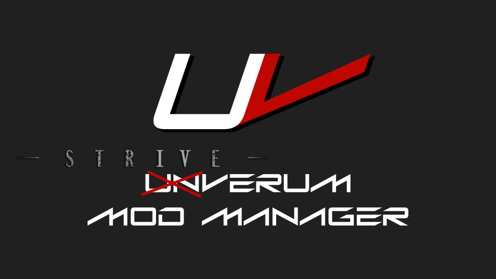

# Striverum Mod Manager

  

**Striverum** is a modern, high-performance mod manager built specifically for **Guilty Gear -Strive-**, forked and reworked from [Unverum](https://github.com/TekkaGB/Unverum) by TekkaGB.

Striverum reimagines mod management with a laser-focus on Guilty Gear -Strive-, bringing extensive Quality-of-Life (QoL) improvements, fluid navigation, advanced filtering, and a sleek dark aesthetic tailored to the game.

---

## Key Features & QoL Improvements

-**Smart Tagging & Filtering**
  - Instant filtering by character, category, author, and sound types.
  - Interactive tag bubbles directly on mod cards — click any character or sound tag to instantly isolate matching mods.

- **In-Place Animated Sidebar Navigation**
  - Smooth sliding transitions between primary sections (Skins, Sounds, Stages, UI, etc.) and deep subcategories directly in the sidebar.
  - Dedicated back button navigation with live mod count badges for both installed and browse-ready mods.

- **Enhanced Mod Browser & GameBanana Sync**
  - Live mod counts fetched directly from GameBanana for every category.
  - Fast search, category filtering, and seamless 1-click mod downloads.

- **Media Carousel & Fullscreen Lightbox**
  - Interactive screenshot gallery on mod details with centered active previews.
  - Distraction-free enlarged lightbox modal with image descriptions and titles.

- **Modernized Dark UI**
  - Clean, neutral dark palette matched to Guilty Gear -Strive- aesthetic.
  - Custom compact scrollbars and smooth wheel scrolling across all lists and viewers.
  - Redesigned modal dialogs for loadout options, mod creation, and launcher selection.

- **Dedicated Guilty Gear -Strive- Workflow**
  - Automatic Steam installation detection (`GGST.exe`).
  - Full loadout management: create blank/enabled loadouts, clone, rename, and switch on the fly.
  - Built-in costume patching, signature bypass, and clean pak generation.

---

## Getting Started

### Prerequisites
- Windows 10/11 (64-bit)
- [.NET 6.0 Desktop Runtime](https://dotnet.microsoft.com/download/dotnet/6.0)

### Installation & Setup
1. Download the latest release from the [Releases](https://github.com/KirinToru/Striverum/releases) page.
2. Extract the archive into a folder of your choice (e.g. `C:\Games\Striverum`).
3. Launch `Striverum.exe`.
4. Click **Setup** and select your `GGST.exe` file (usually located under `Steam\steamapps\common\GUILTY GEAR -STRIVE-\GGST.exe`).
5. You're ready to install and manage mods!

### Installing Mods
- **Built-in Browser**: Switch to the **Browse Mods** tab, find mods you like, and click download.
- **1-Click Install**: Use GameBanana 1-click installation links from your browser.
- **Manual Install**: Click **Add Mods** to drop mod folders or archives directly into your mods directory.

### Activating & Launching
1. Check the boxes next to the mods you want active.
2. Drag and drop mods to adjust priority (top rows take priority over lower rows).
3. Select your desired launcher option (Steam / Vanilla).
4. Click **Launch** — Striverum will automatically stage mods, apply paks, and launch the game.

---

## Updates

Striverum features built-in self-updating via GitHub Releases. When a new release is published to the repository, you'll receive an in-app changelog notification with automatic one-click updating.

---

## 📜 License & Credits

- **Striverum** is licensed under the [GNU General Public License v3.0 (GPL-3.0)](LICENSE).
- Based on and forked from **Unverum** originally developed by [TekkaGB](https://github.com/TekkaGB/Unverum).
- Thanks to the ArcSys modding community, GameBanana, and contributors.
